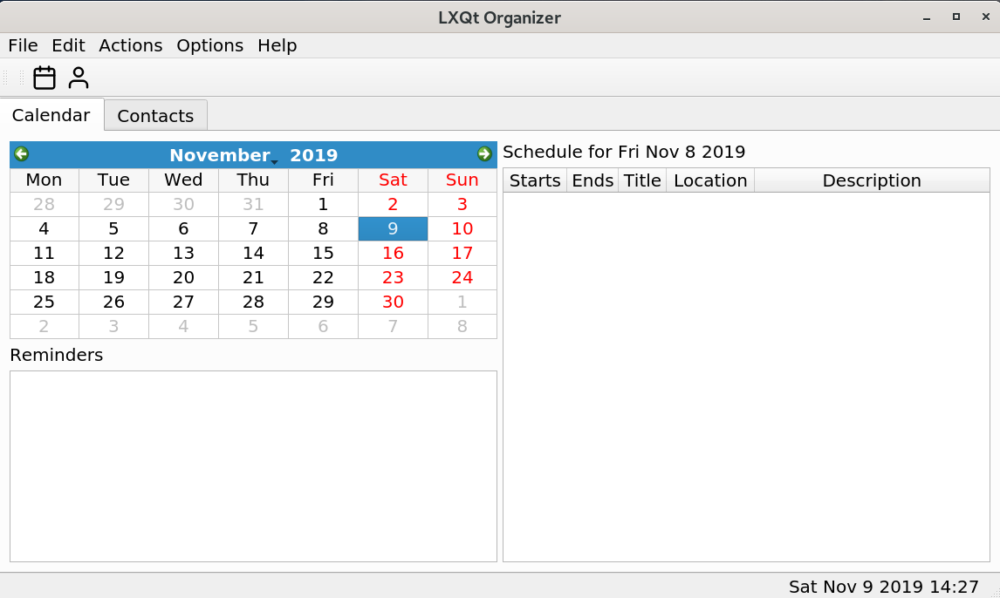

# lxqt-organizer
LXQt Organizer is a lightweight organizer for personal information management.



## Overview

v002

* add and remove hour appointments

* reminder notifications


v003 alpha

* set appointments on hour and minute

* add and remove contacts

* current birthdays added to appointment schedule

* single shot reminder notifications

* XML export of appointments and contacts

v003 alpha2

* edit appointments and contacts

* birthdays added to calendar

* checking for upcoming birthdays (next 7 days)

* reminder today messages

* XML import of appointments and contacts


v003 alpha3

* updated contact details

* current date marked on calendar

### Compiling source code
#### Build Dependencies

Dependencies (v003 Alpha)

ldd /path/to/lxqt-organizer

linux-vdso.so.1 (0x00007fffd619c000)
libQt5Sql.so.5 => /lib/x86_64-linux-gnu/libQt5Sql.so.5 
libQt5DBus.so.5 => /lib/x86_64-linux-gnu/libQt5DBus.so.5 
libQt5Svg.so.5 => /lib/x86_64-linux-gnu/libQt5Svg.so.5 
libQt5Xml.so.5 => /lib/x86_64-linux-gnu/libQt5Xml.so.5 
libQt5Widgets.so.5 => /lib/x86_64-linux-gnu/libQt5Widgets.so.5 
libQt5Gui.so.5 => /lib/x86_64-linux-gnu/libQt5Gui.so.5 
libQt5Core.so.5 => /lib/x86_64-linux-gnu/libQt5Core.so.5 
libstdc++.so.6 => /lib/x86_64-linux-gnu/libstdc++.so.6 
libm.so.6 => /lib/x86_64-linux-gnu/libm.so.6 
libgcc_s.so.1 => /lib/x86_64-linux-gnu/libgcc_s.so.1 
libc.so.6 => /lib/x86_64-linux-gnu/libc.so.6 
libpthread.so.0 => /lib/x86_64-linux-gnu/libpthread.so.0 
libdbus-1.so.3 => /lib/x86_64-linux-gnu/libdbus-1.so.3 
libz.so.1 => /lib/x86_64-linux-gnu/libz.so.1 
libGL.so.1 => /lib/x86_64-linux-gnu/libGL.so.1 
libpng16.so.16 => /lib/x86_64-linux-gnu/libpng16.so.16 
libharfbuzz.so.0 => /lib/x86_64-linux-gnu/libharfbuzz.so.0 
libicui18n.so.63 => /lib/x86_64-linux-gnu/libicui18n.so.63 
libicuuc.so.63 => /lib/x86_64-linux-gnu/libicuuc.so.63 
libpcre2-16.so.0 => /lib/x86_64-linux-gnu/libpcre2-16.so.0 
libdouble-conversion.so.1 => /lib/x86_64-linux-gnu/libdouble-conversion.so.1 
libdl.so.2 => /lib/x86_64-linux-gnu/libdl.so.2 
libglib-2.0.so.0 => /lib/x86_64-linux-gnu/libglib-2.0.so.0 
/lib64/ld-linux-x86-64.so.2 
libsystemd.so.0 => /lib/x86_64-linux-gnu/libsystemd.so.0 
libGLX.so.0 => /lib/x86_64-linux-gnu/libGLX.so.0 
libGLdispatch.so.0 => /lib/x86_64-linux-gnu/libGLdispatch.so.0 
libfreetype.so.6 => /lib/x86_64-linux-gnu/libfreetype.so.6 
libgraphite2.so.3 => /lib/x86_64-linux-gnu/libgraphite2.so.3 
libicudata.so.63 => /lib/x86_64-linux-gnu/libicudata.so.63 
libpcre.so.3 => /lib/x86_64-linux-gnu/libpcre.so.3 
librt.so.1 => /lib/x86_64-linux-gnu/librt.so.1 
liblzma.so.5 => /lib/x86_64-linux-gnu/liblzma.so.5 
liblz4.so.1 => /lib/x86_64-linux-gnu/liblz4.so.1 
libgcrypt.so.20 => /lib/x86_64-linux-gnu/libgcrypt.so.20 
libX11.so.6 => /lib/x86_64-linux-gnu/libX11.so.6 
libXext.so.6 => /lib/x86_64-linux-gnu/libXext.so.6 
libgpg-error.so.0 => /lib/x86_64-linux-gnu/libgpg-error.so.0 
libxcb.so.1 => /lib/x86_64-linux-gnu/libxcb.so.1 
libXau.so.6 => /lib/x86_64-linux-gnu/libXau.so.6 
libXdmcp.so.6 => /lib/x86_64-linux-gnu/libXdmcp.so.6 


* lxqt-build-tools
* lib ...
* KF5WindowSystem
* Qt5Svg
* Qt5X11Extras
* X11

## Installation
Please don't do this on production systems

```
mkdir build  
cd build  
cmake ..
make
make install
```

#### Runtime Dependencies
* ${misc:Depends},
* ${shlibs:Depends}

#### Runtime Recommends
* lxqt-organizer-l10n (not implemented yet)
* lxqt-qtplugin

### Binary packages

Official binary packages are not available in the moment.  
One could find the initial packaging for Debian here:  
https://salsa.debian.org/lxqt-team/lxqt-organizer

Arch AUR will come soon.


### Translation (Weblate)
Not available yet - will come soon, when we implemented the translation system.
