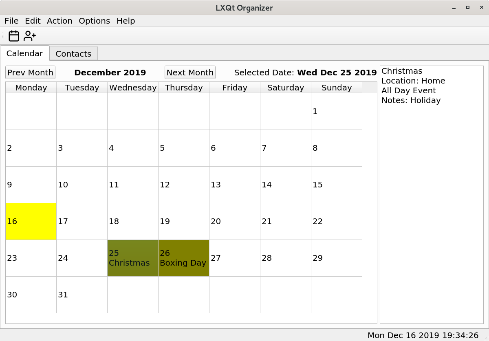

# LXQt Organizer
LXQt Organizer is a lightweight organizer for personal information management.



## Overview

v004 alpha1

* custom calendar

* more options and updates to follow ..

v003 

* set appointments on hour and minute

* add and remove contacts

* edit appointments and contacts

* current birthdays added to calendar

* single shot reminder notifications

* checking for upcoming birthdays (next 7 days)

* reminder today messages

* XML export of appointments and contacts

* XML import of appointments and contacts

v002

* add and remove hour appointments

* reminder notifications


### Compiling source code
#### Build Dependencies

Dependencies (v004 Alpha1)

ldd /path/to/lxqt-organizer

*libQt5Svg.so.5 => /lib/x86_64-linux-gnu/libQt5Svg.so.5 (0x00007ff29ea1f000)

*libQt5Xml.so.5 => /lib/x86_64-linux-gnu/libQt5Xml.so.5 (0x00007ff29e9e0000)

*libQt5Widgets.so.5 => /lib/x86_64-linux-gnu/libQt5Widgets.so.5 (0x00007ff29e389000)

*libQt5Gui.so.5 => /lib/x86_64-linux-gnu/libQt5Gui.so.5 (0x00007ff29ddfe000)

*libQt5Core.so.5 => /lib/x86_64-linux-gnu/libQt5Core.so.5 (0x00007ff29d901000)

*libstdc++.so.6 => /lib/x86_64-linux-gnu/libstdc++.so.6 (0x00007ff29d77d000)

*libm.so.6 => /lib/x86_64-linux-gnu/libm.so.6 (0x00007ff29d5fa000)

*libgcc_s.so.1 => /lib/x86_64-linux-gnu/libgcc_s.so.1 (0x00007ff29d5e0000)

*libc.so.6 => /lib/x86_64-linux-gnu/libc.so.6 (0x00007ff29d41f000)

*libpthread.so.0 => /lib/x86_64-linux-gnu/libpthread.so.0 (0x00007ff29d3fe000)

*libdbus-1.so.3 => /lib/x86_64-linux-gnu/libdbus-1.so.3 (0x00007ff29d3a9000)

*libz.so.1 => /lib/x86_64-linux-gnu/libz.so.1 (0x00007ff29d18b000)

*libGL.so.1 => /lib/x86_64-linux-gnu/libGL.so.1 (0x00007ff29d0f7000)

*libpng16.so.16 => /lib/x86_64-linux-gnu/libpng16.so.16 (0x00007ff29d0be000)

*libharfbuzz.so.0 => /lib/x86_64-linux-gnu/libharfbuzz.so.0 (0x00007ff29cfc3000)

*libicui18n.so.63 => /lib/x86_64-linux-gnu/libicui18n.so.63 (0x00007ff29cce6000)

*libicuuc.so.63 => /lib/x86_64-linux-gnu/libicuuc.so.63 (0x00007ff29cb17000)

*libpcre2-16.so.0 => /lib/x86_64-linux-gnu/libpcre2-16.so.0 (0x00007ff29ca9c000)

*libdouble-conversion.so.1 => /lib/x86_64-linux-gnu/libdouble-conversion.so.1 (0x00007ff29ca85000)

*libdl.so.2 => /lib/x86_64-linux-gnu/libdl.so.2 (0x00007ff29ca80000)

*libglib-2.0.so.0 => /lib/x86_64-linux-gnu/libglib-2.0.so.0 (0x00007ff29c961000)

*/lib64/ld-linux-x86-64.so.2 (0x00007ff29ebe7000)

*libsystemd.so.0 => /lib/x86_64-linux-gnu/libsystemd.so.0 (0x00007ff29c8be000)

*libGLX.so.0 => /lib/x86_64-linux-gnu/libGLX.so.0 (0x00007ff29c88a000)

*libGLdispatch.so.0 => /lib/x86_64-linux-gnu/libGLdispatch.so.0 (0x00007ff29c7cd000)

*libfreetype.so.6 => /lib/x86_64-linux-gnu/libfreetype.so.6 (0x00007ff29c711000)

*libgraphite2.so.3 => /lib/x86_64-linux-gnu/libgraphite2.so.3 (0x00007ff29c6e4000)

*libicudata.so.63 => /lib/x86_64-linux-gnu/libicudata.so.63 (0x00007ff29acf2000)

*libpcre.so.3 => /lib/x86_64-linux-gnu/libpcre.so.3 (0x00007ff29ac7e000)

*librt.so.1 => /lib/x86_64-linux-gnu/librt.so.1 (0x00007ff29ac74000)

*liblzma.so.5 => /lib/x86_64-linux-gnu/liblzma.so.5 (0x00007ff29ac4c000)

*liblz4.so.1 => /lib/x86_64-linux-gnu/liblz4.so.1 (0x00007ff29ac2d000)

*libgcrypt.so.20 => /lib/x86_64-linux-gnu/libgcrypt.so.20 (0x00007ff29ab0f000)

*libX11.so.6 => /lib/x86_64-linux-gnu/libX11.so.6 (0x00007ff29a9cc000)

*libXext.so.6 => /lib/x86_64-linux-gnu/libXext.so.6 (0x00007ff29a7ba000)

*libgpg-error.so.0 => /lib/x86_64-linux-gnu/libgpg-error.so.0 (0x00007ff29a797000)

*libxcb.so.1 => /lib/x86_64-linux-gnu/libxcb.so.1 (0x00007ff29a76d000)

*libXau.so.6 => /lib/x86_64-linux-gnu/libXau.so.6 (0x00007ff29a569000)

*libXdmcp.so.6 => /lib/x86_64-linux-gnu/libXdmcp.so.6 (0x00007ff29a361000)

*libbsd.so.0 => /lib/x86_64-linux-gnu/libbsd.so.0 (0x00007ff29a347000)


## Installation from source (testing purposes only)
Please don't do this on production systems

```
mkdir build  
cd build  
cmake ..
make
su (or sudo)
make install
```

LXQt Organizer is installed to /usr/local/bin

Note: If upgrading from a previous version you need to remove the previous version (as root) located at

/usr/local/bin/lxqt-organizer

and rename (or remove) the 'organizerdb.sqlite' database in your home directory. Make sure to export contacts and then import them into the new version.


#### Runtime Dependencies
* ${misc:Depends},
* ${shlibs:Depends}

#### Runtime Recommends
* lxqt-organizer-l10n (not implemented yet)
* lxqt-qtplugin

### Binary packages

Official binary packages are not available in the moment.  
One could find the initial packaging for Debian here:  
https://salsa.debian.org/lxqt-team/lxqt-organizer

Arch AUR will come soon.


### Translation (Weblate)
Not available yet - will come soon, when we implemented the translation system.
