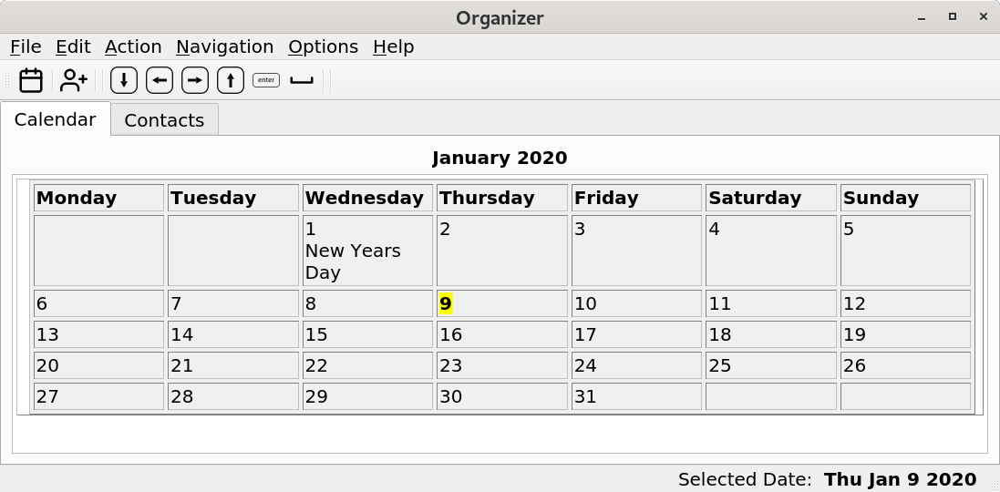

# Organizer
Organizer is a lightweight personal information manager consisting of a calendar and contacts list. Data is stored locally in the user account and not online. Appointments are added and displayed in the calendar using an entry form allowing the date, start and end times, description and category to be set. Repeating appointments can be generated. Organizer is a Qt based application for the LXQt desktop project.



## Overview

v005 alpha1

* Calendar enhancements

```
Single click date to show appointments
Double click date to add new appointment
```

* Calendar themes


v004 

* custom calendar

* calendar keyboard navigation

```
up arrow = next month
down arrow = previous month
spacebar = back to today`
```

* key actions for  new contact
```
key_c = new contact
```

* double click contacts to edit

* double click appointments (in day view) to edit

* repeat appointments generator

* replaced reminders with show upcoming schedule

* tested using Debian 10 LXQt and other desktops such as gnome


v003 

* set appointments on hour and minute

* add and remove contacts

* edit appointments and contacts

* current birthdays added to calendar

* checking for upcoming birthdays (next 7 days)

* reminder today messages

* XML export contacts

* XML import contacts

v002

* add and remove hour appointments

* reminder notifications


### Compiling source code
#### Build Dependencies

Dependencies (v004 )

ldd /path/to/organizer

```
linux-vdso.so.1 
libQt5Sql.so.5 => /lib/x86_64-linux-gnu/libQt5Sql.so.5 
libQt5Svg.so.5 => /lib/x86_64-linux-gnu/libQt5Svg.so.5 
libQt5Xml.so.5 => /lib/x86_64-linux-gnu/libQt5Xml.so.5 
libQt5Widgets.so.5 => /lib/x86_64-linux-gnu/libQt5Widgets.so.5 
libQt5Gui.so.5 => /lib/x86_64-linux-gnu/libQt5Gui.so.5 
libQt5Core.so.5 => /lib/x86_64-linux-gnu/libQt5Core.so.5 
libstdc++.so.6 => /lib/x86_64-linux-gnu/libstdc++.so.6 
libm.so.6 => /lib/x86_64-linux-gnu/libm.so.6 
libgcc_s.so.1 => /lib/x86_64-linux-gnu/libgcc_s.so.1 
libc.so.6 => /lib/x86_64-linux-gnu/libc.so.6 
libz.so.1 => /lib/x86_64-linux-gnu/libz.so.1 
libpthread.so.0 => /lib/x86_64-linux-gnu/libpthread.so.0 
libGL.so.1 => /lib/x86_64-linux-gnu/libGL.so.1 
libpng16.so.16 => /lib/x86_64-linux-gnu/libpng16.so.16 
libharfbuzz.so.0 => /lib/x86_64-linux-gnu/libharfbuzz.so.0 
libicui18n.so.63 => /lib/x86_64-linux-gnu/libicui18n.so.63 
libicuuc.so.63 => /lib/x86_64-linux-gnu/libicuuc.so.63 
libpcre2-16.so.0 => /lib/x86_64-linux-gnu/libpcre2-16.so.0 
libdouble-conversion.so.1 => /lib/x86_64-linux-gnu/libdouble-conversion.so.1 
libdl.so.2 => /lib/x86_64-linux-gnu/libdl.so.2 
libglib-2.0.so.0 => /lib/x86_64-linux-gnu/libglib-2.0.so.0 /lib64/ld-linux-x86-64.so.2 
libGLX.so.0 => /lib/x86_64-linux-gnu/libGLX.so.0 (0x00007fb8f4ef3000)libGLdispatch.so.0 => /lib/x86_64-linux-gnu/libGLdispatch.so.0 
libfreetype.so.6 => /lib/x86_64-linux-gnu/libfreetype.so.6 
libgraphite2.so.3 => /lib/x86_64-linux-gnu/libgraphite2.so.3 
libicudata.so.63 => /lib/x86_64-linux-gnu/libicudata.so.63 
libpcre.so.3 => /lib/x86_64-linux-gnu/libpcre.so.3 
libX11.so.6 => /lib/x86_64-linux-gnu/libX11.so.6 
libXext.so.6 => /lib/x86_64-linux-gnu/libXext.so.6 
libxcb.so.1 => /lib/x86_64-linux-gnu/libxcb.so.1 
libXau.so.6 => /lib/x86_64-linux-gnu/libXau.so.6 
libXdmcp.so.6 => /lib/x86_64-linux-gnu/libXdmcp.so.6 
libbsd.so.0 => /lib/x86_64-linux-gnu/libbsd.so.0 
librt.so.1 => /lib/x86_64-linux-gnu/librt.so.1 
```


## Installation from source (testing purposes only)
Please don't do this on production systems

```
mkdir build  
cd build  
cmake ..
make
su (or sudo)
make install
```

Organizer is installed to /usr/local/bin

Note: If upgrading from a previous version you need to remove the previous version (as root) located at

/usr/local/bin/organizer

and rename (or remove) the 'organizerdb.sqlite' database in your home directory. Make sure to export contacts and then import them into the new version.


#### Runtime Dependencies
* ${misc:Depends},
* ${shlibs:Depends}

#### Runtime Recommends
* lxqt-organizer-l10n (not implemented yet)
* lxqt-qtplugin

### Binary packages

Official binary packages are not available in the moment.  
One could find the initial packaging for Debian here:  
https://salsa.debian.org/lxqt-team/lxqt-organizer

Arch AUR will come soon.


### Translation (Weblate)
Not available yet - will come soon, when we implemented the translation system.
